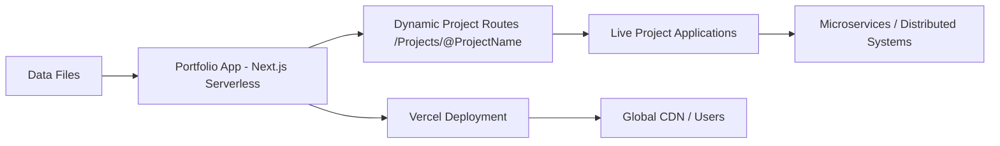

# Personal Portfolio – Live Project Showcase

> **Version 2.0.0** – A production-ready portfolio designed to **showcase live, monitored projects** and provide a central interaction point for testing technologies, distributed systems, and microservices in real-world scenarios.

---

## Overview
This personal portfolio functions as a **production-grade application hub**, showcasing a constantly evolving range of projects — from early experiments to fully deployed live applications.

The main site acts as an **interaction point** with multiple independently deployed projects. While the portfolio itself is serverless and minimal in its own logic, it connects to, monitors, and presents applications that may have their own backends, microservices, or distributed architectures.

### Evolution of the Portfolio
- **Version 1** – A static, serverless Node.js site primarily displaying snapshots and screenshots from development environments.
- **Version 2.0.0** – Introduces **live project integration**, routing visitors directly to the most recent deployed project. This upgrade focuses on testing live systems, expanding into distributed and microservice-based projects, and supporting dynamic interaction rather than static previews.

---

## Features
- **Live Project Interaction** – View and interact with fully deployed projects in real time.
- **Dynamic Project Routing** – Each project has its own dedicated route (`/Projects/[slug]`) for deep linking.
- **Separate Environments** –  
  - **Development branch**: A technical sandbox for testing and refining projects to ~98% completion before DNS promotion.
  - **Production branch**: Stable, public-facing portfolio linked to the main domain.
  - **Preview deployments** for every branch commit via Vercel.
- **Data-Driven Content** – Project descriptions, media, and metadata are managed in a structured data directory for easy updates without heavy code changes.
- **Evolving Showcase** – Direct routes house current projects; contents change as new projects are completed and old ones are retired.

---

## Architecture & Deployment Flow
**High-Level Flow:**
1. **Data Layer** – Project entries stored in structured data files (descriptions, media paths, metadata).
2. **Portfolio Application** – Serverless Next.js App Router site rendering projects dynamically from the data layer.
3. **Live Projects** – Deployed independently; may have their own server-based backends or microservices.
4. **Deployment Process**:  
   - Commit to `dev` branch → automatic **preview deployment** on Vercel.  
   - Promote to `main` branch → **production deployment** and DNS update.  
   - Vercel handles build, cache invalidation, and edge CDN distribution.

---

## Installation & Local Development

### Local Setup
```bash
# Clone the repository
git clone https://github.com/Leosly7663/portfolio-showcase.git
cd portfolio-showcase

# Install dependencies
npm install

# Run development server
npm run dev

# Access locally
# Usually available at http://localhost:3000
```

### Deployment
- **Preview Deployments**: Triggered automatically by commits to non-production branches.
- **Production Deployment**: Triggered by merging into the `main` branch.
- **Vercel** handles:  
  - Static asset optimization.  
  - Global CDN distribution.  
  - Edge caching for sub-50ms global TTFB.

---

## Project Data Management
- **Descriptions & Media**: Stored in `/Data` directory; edit to update live portfolio content.
- **Images & Media Library**: Managed in `/public` or project-specific asset folders.
- **Project Routing**:  
  - Each project has a `[slug]` route under `/Projects`.  
  - Once a project is opened, functionality is handled by the project’s own application, not the portfolio itself.

---

## Project Structure
```
.
├── app/
│   ├── Assets/                # Static assets for portfolio
│   ├── Components/            # UI components
│   ├── Data/                   # Project descriptions, media references
│   ├── Projects/[slug]/        # Direct routes for active projects
│   ├── ResumeScanner/          # Example embedded project
│   ├── python-HUD/             # Example embedded project
│   └── utils/                  # Utility scripts
├── public/                     # Static media library
├── tailwind.config.ts          # Tailwind config
├── globals.css                 # Global styles
└── package.json
```

---

## Future Improvements
- **Refine Structure** – Streamline data and asset organization for easier scaling.
- **Integration Planning** – Expand to integrate with a broader range of technologies and backend systems.
- **Project Lifecycle Management** – Automated rotation of featured projects based on deployment status.
- **Live Monitoring Dashboard** – Add health/status checks for linked projects.

---

## License
This portfolio is a personal project and **not open for contributions**. All rights reserved.

---

## Architecture Diagram

